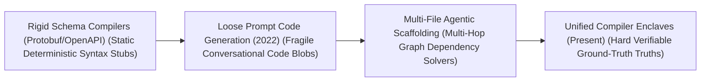
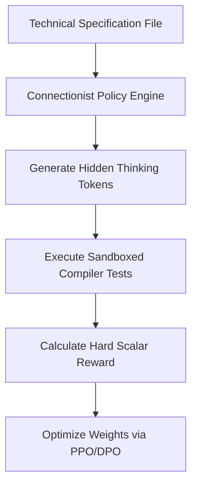

# Awesome-Spec-Driven-Development
## Spec-Driven Development (SDD) using AI: History, Progression, Variants, & Applications

**Spec-Driven Development (SDD) using AI** is an advanced software engineering methodology and workflow paradigm that leverages generative Artificial Intelligence to automatically synthesize, refactor, and verify production-grade software codebases directly from machine-readable, unambiguous technical specifications [INDEX: 12, 17]. In traditional software engineering, developers convert abstract human requirements into written code manually, a process highly prone to translation errors, architectural divergence, and edge-case bugs. 

SDD inverts and automates this pipeline. By treating the software specification (e.g., OpenAPI schemas, Protocol Buffers, state charts, or architectural markdown files) as the absolute source of truth, autonomous AI coding agents and compiler-locked reinforcement learning loops handle implementation details [INDEX: 12, 17]. This transforms software engineering from manual syntax writing into continuous, high-level structural modeling and programmatic validation.

---

## 1. The Macro Chronological Evolution

The technical framework governing spec-to-code synthesis has transitioned from rigid template compilation to loose prompt-engineered transformations, moving toward multi-file agentic scaffolding and modern test-time verification enclaves.

*   **The Static Deterministic Schema Compilation Era (Traditional Software Baseline)**
    *   *Concept:* The classical engineering baseline. Tools like Protocol Buffers, gRPC, and Swagger/OpenAPI used specialized compilers (e.g., `protoc`) to read structured definition schemas and output raw, un-implemented boilerplate code stubs across different languages.
    *   *Limitation:* Completely un-intelligent. The compilers were incapable of writing actual business logic, algorithms, or complex internal data mutations, requiring human engineers to manually build out features within the stubs.
*   **The Loose Prompt Code Generation Era (~2022–2023)**
    *   *Concept:* Introduced generative language model scale to programming tasks [INDEX: 15]. Pre-trained autoregressive transformers (such as early GPT-3.5 or Copilot models) ingested conversational human requests or descriptive technical text lines inside a single context window prefix, guessing and outputting isolated blocks of code stubs [INDEX: 11].
    *   *Limitation:* Extreme structural fragility and single-file isolation. The models generated code purely based on soft token-level probabilistic mimicry; they lacked systemic awareness of cross-directory file dependencies and were profoundly prone to inventing hallucinated API properties or broken syntaxes under stress.
*   **The Multi-File Agentic Workspace Scaffolding Era (~2023–2024)**
    *   *Concept:* Scaled up AI spec execution out of isolated prompt windows and straight into multi-file corporate workspace graphs [INDEX: 12]. Autonomous agent platforms (such as Devin or early repo-level coding bots) leverage tool-augmented pipelines via the **Model Context Protocol (MCP)** [INDEX: 12]. The agent reads a multi-tiered repository specification, mapping out directory dependencies connectionally before editing files [INDEX: 12].
    *   *Limitation:* Heavy API token billing latency and vulnerability to cascading logic errors if early structural assumptions diverged from backend realities.
*   **The Compiler-Locked Unified Verification Enclave Era (~2025–Present)**
    *   *Concept:* The current modern state-of-the-art production infrastructure standard underpining frontier software development networks. It bridges connectionist data generation with exact logical validation by porting code induction into **System 2 hidden thinking token traces** driven by large-scale Reinforcement Learning (RL) [INDEX: 1, 18, 21].
    *   *Significance:* Unlocked via advanced reasoning models (such as OpenAI's o-series and DeepSeek-R1) [INDEX: 18, 21]. The model treats a code specification as a strict, non-negotiable environment constraint [INDEX: 17]. As it writes thinking tokens, it dispatches raw scripts to local sandboxed containers or interactive theorem provers natively [INDEX: 12, 17]. The token stream is only rewarded if the generated logic passes compiler validation and executes all unit-test specifications with zero errors, ensuring absolute semantic correctness [INDEX: 17].

---

## 2. Core Functional & Algorithmic SDD Variants

AI-driven Spec Development methodologies are strictly categorized based on the exact format of the technical specification and the operational tracking loops used to compile the codebase.

- ### A. Schema-Driven Generation (OpenAPI / Type Specs)
	*   **Mechanism:** Ingests highly rigid, machine-readable REST API or database schema definitions (YAML/JSON schemas). The AI model processes the input constraints, automatically writing complete, production-ready route handlers, payload validators, database integration layers, and comprehensive mock testing environments natively.

- ### B. Formal Specification Proving (TLA+ / Verilog Assertions)
	*   **Mechanism:** Targets mission-critical, high-reliability embedded system architectures (aerospace firmware, hardware silicon chips). The AI model translates raw human functional requirements into mathematically rigorous formal specification languages (like TLA+ or Coq), using interactive theorem provers to verify logic boundaries before synthesizing final code blocks.

- ### C. Test-Driven AI Specification (BDD / TDD Loops)
	*   **Mechanism:** Uses Behavior-Driven Development (BDD) syntax written in Gherkin styles (e.g., `Feature: User Login \n Given a user is logged out \n When...`) as the non-negotiable specification document. The AI agent reads the tests, spins up a local sandboxed terminal, and writes code iteratively inside a loop until 100% of the spec tests pass cleanly.

- ### D. In-Context Spec Adaptation (Prompt-Space Compilation)
	*   **Mechanism:** Utilizes frozen long-context autoregressive decoders [INDEX: 11, 22]. By loading an entire multi-hundred page architectural specification or API documentation portfolio straight into the model's active window prefix via Rotary Position Embeddings (RoPE), the self-attention layers dynamically realign representation coordinates to decode customized scripts zero-shot at runtime [INDEX: 11, 18].

---

## 3. The Spec-to-Code Verification Matrix

To execute multi-file software refactoring without triggering execution stalls, the agentic architecture routes token streams through synchronized sandboxed checkpoints [INDEX: 12].

*   **Process-Supervised Step Verifiers (PRMs)**
    *   *Profile:* Granular token step quality auditing [INDEX: 16]. When an automated coding engine synthesizes intermediate multi-step thinking traces, a process-supervised value network checks each intermediate logic line dynamically to catch code drift or structural hallucinations early [INDEX: 1, 16].
*   **PagedAttention Virtual Memory block Caching**
    *   *Profile:* Memory-efficient branching [INDEX: 22]. When exploring multiple alternative symbolic refactoring tracks inside the workspace concurrently, child branches share identical pointers to the parent memory blocks, allocating fresh physical VRAM slots natively only when a branch writes a distinct token ID [INDEX: 22].

---

## 4. Production Engineering Challenges & Infrastructure Mitigations

Deploying large-scale automated Spec-Driven pipelines across distributed high-performance computing configurations introduces severe context window constraints and data-security vulnerabilities.

- ### The Token Inflation and VRAM Cache Satiation Crisis
	*   **The Problem:** Because reasoning models must write thousands of verbose, intermediate thinking tokens, tool calls, and error refactoring passes before finalizing a script, the active Key-Value attention cache inflates aggressively [INDEX: 22]. This consumes immense amounts of GPU VRAM per user session, slowing processing speeds and triggering system-wide Out-of-Memory (OOM) crashes [INDEX: 22].
	*   **Mitigation:** Implementing **Multi-Head Latent Attention (MLA)** to compress active cached attention matrices into low-rank latent vectors [INDEX: 18], coupled with **PagedAttention virtual memory mapping** to optimize tensor slot allocations non-contiguously [INDEX: 22].

- ### The Context Contamination and Indirect Prompt Injection Threat
	*   **The Problem:** As general coding agents gain autonomous tool-calling privileges (cloning repositories, parsing third-party dependency files, reading remote documentation URLs), they become highly vulnerable to **Indirect Prompt Injection** [INDEX: 12, 19]. An attacker can hide stealthy, natural language instructions inside a repository file; when the AI reads the codebase to execute a specification, the payload overrides the model's internal system guardrails, hijacking its terminal execution privileges to exfiltrate private API keys silently [INDEX: 12, 19].
	*   **Mitigation:** Bypassing surface-level prompt rules entirely by deploying overcomplete **Sparse Autoencoders (SAEs)** [INDEX: 2]. SAEs isolate abstract conceptual directions into distinct monosemantic feature channels [INDEX: 2], letting trust and safety modules precisely inject negative activation steering vectors at runtime to neutralize authentic hazards without inducing collateral feature degradation [INDEX: 2].

---

## 5. Frontier Real-World AI Industrial Applications

*   **Autonomous Software Engineering & Sandbox Repository Maintenance**
    *   *Application:* Drives elite automated developer platforms (such as Devin, Cursor, or specialized enterprise repository agents) [INDEX: 22]. The spec-driven neuro-symbolic framework forces the model to treat engineering tickets as a closed-loop search problem: reading file trees connectionally, parsing OpenAPI/Gherkin spec files, testing patches inside local Docker sandboxes, and refactoring scripts recursively until all unit tests pass zero-shot [INDEX: 12, 17].
*   **Automated Corporate Financial Auditing & SQL Query Generation**
    *   *Application:* Processes multi-departmental corporate profiles and database extraction tasks. Tool-augmented spec engines read structural database schemas and data-dictionary text files; if a generated SQL query returns an optimization or schema lookup error, the model reads the database trace, re-maps its table joins, and executes corrected macros automatically [INDEX: 12].
*   **Mission-Critical Aerospace and Chip Hardware Verification**
    *   *Application:* Hardens the safety perimeters of high-reliability automation. Neuro-symbolic pipelines translate conversational system requirements into mathematically rigorous formal specifications (such as TLA+ or Verilog assertions), using interactive theorem provers (Lean 4) to check logic lines continuously and self-correct syntax until the proof compiles flawlessly.

---

## References
1. Vaswani, A., et al. (2017). Attention is all you need: Scalable foundational transformer matrix blocks. *Advances in Neural Information Processing Systems (NeurIPS)*, 30 [INDEX: 1].
2. Brown, T., et al. (2020). Language models are few-shot learners: In-context learning scaling frontiers. *Advances in Neural Information Processing Systems (NeurIPS)*, 33, 1877-1901 [INDEX: 11, 15].
3. Lightman, H., et al. (2023). Let's verify step by step: Process-supervised token validation loops. *arXiv preprint arXiv:2305.20050* [INDEX: 16].
4. Kwon, W., et al. (2023). Efficient virtual memory management for long-context language model serving loops via pagedattention block routing. *vLLM Open-Source Infrastructure Framework Manual* [INDEX: 22].
5. Anthropic Development Team. (2024). Model Context Protocol (MCP): Standardizing client-server tool abstractions for foundational models. *Anthropic Open-Source Architecture Manifesto* [INDEX: 12].
6. DeepSeek-AI. (2025). DeepSeek-R1: Incentivizing reasoning and verification capability in foundational language transformers via large-scale self-play reinforcement learning loops initialized via curriculum SFT cold-starts. *GitHub Repository Technical Infrastructure Manifesto* [INDEX: 18, 21].

---

To advance this documentation repository, automated software-engineering pipeline, or MLOps architecture, consider exploring these adjacent development pathways:
* Build a **Python script using PyTorch and the Model Context Protocol (MCP) SDK** illustrating how to declare a standard tool schema layout, capture an autonomous function-calling response block, and return execution logs cleanly to a reasoning model client [INDEX: 12].
* Generate a **comprehensive Markdown table** explicitly comparing Classical Schema Compilers (`protoc`), Loose Prompt Code Generation, Multi-File Agentic Scaffolding, and Compiler-Locked Neuro-Symbolic RL (o1/R1) across mathematical time complexities, requirement for explicit human annotation layers, susceptibility to semantic hallucinations, and downstream cross-domain transfer efficiencies [INDEX: 17, 21].
* Establish an **automated performance profiling suite using PyTorch Profiler** to track the exact cluster-wide compute efficiency, worker synchronization times, and memory bus bandwidth compression achieved when executing an enterprise multi-file pre-fill training pass over distributed server nodes [INDEX: 22].

***

**Follow-Up Options Matrix:**

Before updating this documentation repository framework layout, let me know how you would like to proceed by choosing one of the options below:
* I can provide a **complete Python code boilerplate using PyTorch** demonstrating how to write an automated script that calculates an exact preference optimization loss loop configured over an execution dataset [INDEX: 11].
* I can generate a **Markdown matrix table** tracking the default context boundaries, exemplar capacities, and structural pooling layers of the leading foundation open-weight reasoning models [INDEX: 15, 21].
* I can write a detailed technical explanation focusing on the **mathematics of Process-Supervised Reward Models (PRMs)** and how value networks calculate token-level logic scores [INDEX: 16].

