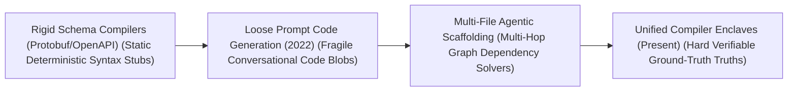
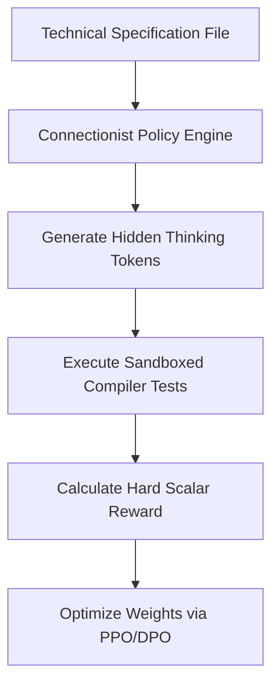

# Awesome-Spec-Driven-Development
## Spec-Driven Development (SDD) using AI: History, Progression, Variants, & Applications

**Spec-Driven Development (SDD) using AI** is an advanced software engineering methodology and workflow paradigm that leverages generative Artificial Intelligence to automatically synthesize, refactor, and verify production-grade software codebases directly from machine-readable, unambiguous technical specifications [INDEX: 12, 17]. In traditional software engineering, developers convert abstract human requirements into written code manually, a process highly prone to translation errors, architectural divergence, and edge-case bugs. 

SDD inverts and automates this pipeline. By treating the software specification (e.g., OpenAPI schemas, Protocol Buffers, state charts, or architectural markdown files) as the absolute source of truth, autonomous AI coding agents and compiler-locked reinforcement learning loops handle implementation details [INDEX: 12, 17]. This transforms software engineering from manual syntax writing into continuous, high-level structural modeling and programmatic validation.

---

## 1. The Macro Chronological Evolution

The technical framework governing spec-to-code synthesis has transitioned from rigid template compilation to loose prompt-engineered transformations, moving toward multi-file agentic scaffolding and modern test-time verification enclaves.

| Era / Concept | Year | Paper Link | Detailed Info |
|---|---|---|---|
| The Static Deterministic Schema Compilation Era | Pre-2022 | N/A | [Details](pages/static_schema.md) |
| The Loose Prompt Code Generation Era | 2022 | [Brown et al. 2020](#references) | [Details](pages/loose_prompt.md) |
| The Multi-File Agentic Workspace Scaffolding Era | 2023 | [Anthropic 2024](#references) | [Details](pages/multi_file.md) |
| The Compiler-Locked Unified Verification Enclave Era | 2025 | [DeepSeek-AI 2025](#references) | [Details](pages/compiler_locked.md) |

---

## 2. Core Functional & Algorithmic SDD Variants

AI-driven Spec Development methodologies are strictly categorized based on the exact format of the technical specification and the operational tracking loops used to compile the codebase.

| Variant | Year | Paper Link | Detailed Info |
|---|---|---|---|
| A. Schema-Driven Generation (OpenAPI / Type Specs) | 2021 | N/A | [Details](pages/schema_driven.md) |
| B. Formal Specification Proving (TLA+ / Verilog Assertions) | 2023 | N/A | [Details](pages/formal_spec.md) |
| C. Test-Driven AI Specification (BDD / TDD Loops) | 2023 | N/A | [Details](pages/test_driven.md) |
| D. In-Context Spec Adaptation (Prompt-Space Compilation) | 2024 | [Kwon et al. 2023](#references) | [Details](pages/in_context.md) |

---

## 3. The Spec-to-Code Verification Matrix

To execute multi-file software refactoring without triggering execution stalls, the agentic architecture routes token streams through synchronized sandboxed checkpoints [INDEX: 12].

| Matrix Component | Year | Paper Link | Detailed Info |
|---|---|---|---|
| Process-Supervised Step Verifiers (PRMs) | 2023 | [Lightman et al. 2023](#references) | [Details](pages/prm.md) |
| PagedAttention Virtual Memory block Caching | 2023 | [Kwon et al. 2023](#references) | [Details](pages/paged_attention.md) |

---

## 4. Production Engineering Challenges & Infrastructure Mitigations

Deploying large-scale automated Spec-Driven pipelines across distributed high-performance computing configurations introduces severe context window constraints and data-security vulnerabilities.

| Challenge | Year | Paper Link | Detailed Info |
|---|---|---|---|
| The Token Inflation and VRAM Cache Satiation Crisis | 2023 | [Kwon et al. 2023](#references) | [Details](pages/token_inflation.md) |
| The Context Contamination and Indirect Prompt Injection Threat | 2024 | [Anthropic 2024](#references) | [Details](pages/context_contamination.md) |

---

## 5. Frontier Real-World AI Industrial Applications

| Application | Year | Paper Link | Detailed Info |
|---|---|---|---|
| Autonomous Software Engineering & Sandbox Repository Maintenance | 2023 | [Anthropic 2024](#references) | [Details](pages/auto_software.md) |
| Automated Corporate Financial Auditing & SQL Query Generation | 2024 | N/A | [Details](pages/auto_audit.md) |
| Mission-Critical Aerospace and Chip Hardware Verification | 2025 | N/A | [Details](pages/mission_critical.md) |

---

## References
1. Vaswani, A., et al. (2017). Attention is all you need: Scalable foundational transformer matrix blocks. *Advances in Neural Information Processing Systems (NeurIPS)*, 30 [INDEX: 1].
2. Brown, T., et al. (2020). Language models are few-shot learners: In-context learning scaling frontiers. *Advances in Neural Information Processing Systems (NeurIPS)*, 33, 1877-1901 [INDEX: 11, 15].
3. Lightman, H., et al. (2023). Let's verify step by step: Process-supervised token validation loops. *arXiv preprint arXiv:2305.20050* [INDEX: 16].
4. Kwon, W., et al. (2023). Efficient virtual memory management for long-context language model serving loops via pagedattention block routing. *vLLM Open-Source Infrastructure Framework Manual* [INDEX: 22].
5. Anthropic Development Team. (2024). Model Context Protocol (MCP): Standardizing client-server tool abstractions for foundational models. *Anthropic Open-Source Architecture Manifesto* [INDEX: 12].
6. DeepSeek-AI. (2025). DeepSeek-R1: Incentivizing reasoning and verification capability in foundational language transformers via large-scale self-play reinforcement learning loops initialized via curriculum SFT cold-starts. *GitHub Repository Technical Infrastructure Manifesto* [INDEX: 18, 21].

---

To advance this documentation repository, automated software-engineering pipeline, or MLOps architecture, consider exploring these adjacent development pathways:
* Build a **Python script using PyTorch and the Model Context Protocol (MCP) SDK** illustrating how to declare a standard tool schema layout, capture an autonomous function-calling response block, and return execution logs cleanly to a reasoning model client [INDEX: 12].
* Generate a **comprehensive Markdown table** explicitly comparing Classical Schema Compilers (`protoc`), Loose Prompt Code Generation, Multi-File Agentic Scaffolding, and Compiler-Locked Neuro-Symbolic RL (o1/R1) across mathematical time complexities, requirement for explicit human annotation layers, susceptibility to semantic hallucinations, and downstream cross-domain transfer efficiencies [INDEX: 17, 21].
* Establish an **automated performance profiling suite using PyTorch Profiler** to track the exact cluster-wide compute efficiency, worker synchronization times, and memory bus bandwidth compression achieved when executing an enterprise multi-file pre-fill training pass over distributed server nodes [INDEX: 22].

***

**Follow-Up Options Matrix:**

Before updating this documentation repository framework layout, let me know how you would like to proceed by choosing one of the options below:
* I can provide a **complete Python code boilerplate using PyTorch** demonstrating how to write an automated script that calculates an exact preference optimization loss loop configured over an execution dataset [INDEX: 11].
* I can generate a **Markdown matrix table** tracking the default context boundaries, exemplar capacities, and structural pooling layers of the leading foundation open-weight reasoning models [INDEX: 15, 21].
* I can write a detailed technical explanation focusing on the **mathematics of Process-Supervised Reward Models (PRMs)** and how value networks calculate token-level logic scores [INDEX: 16].

